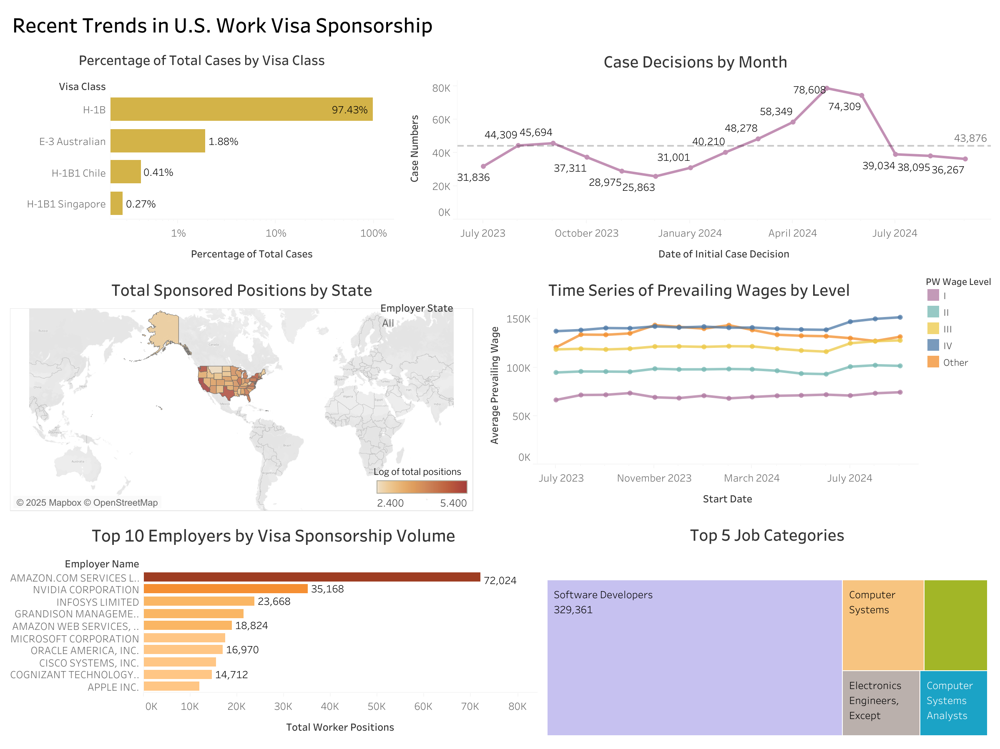

# Recent Trends in U.S. Work Visa Sponsorship (2023–2024)

## Introduction

The sponsorship of foreign workers in the United States plays a vital role in addressing labor shortages and supporting high-demand industries. Employers increasingly rely on visa programs such as H-1B to fill specialized roles, while foreign professionals seek long-term career opportunities through these pathways. 

This project explores recent trends in U.S. work visa sponsorship using data from the Labor Condition Application (LCA) Disclosure Data across five fiscal quarters.

## Data Source

The dataset is based on the U.S. Department of Labor's LCA Disclosure Data, covering:

- **Timeframe:** Q3 2023 to Q3 2024  
- **Volume:** 5 separate CSV files (each ~100,000 rows × 97 columns)  
- **Features:** Includes spatial (city, state), temporal (decision dates), categorical (visa class, employer), and numerical (wages, worker count) attributes

> Note: Fiscal labels refer to disclosure years. For example, FY2024 Q1 includes applications filed in calendar Q4 2023.

## Data Cleaning

The cleaning process was done in Python (`data_cleaning.ipynb`) and included:

- Standardizing column names
- Filtering only certified applications
- Handling missing and duplicate values
- Aggregating sponsored worker counts by employer, state, and SOC title
- Merging quarterly datasets into a single clean dataset for visualization

## Data Visualization

The final interactive dashboard was created using Tableau. It explores key questions such as:

- What are the most commonly used visa classes?
- Which employers and states sponsor the most foreign workers?
- How do prevailing wage trends vary over time and by wage level?
- Which job categories are most frequently sponsored?

### Dashboard Preview

> Open the Tableau workbook: `us_visa_sponsorship_trends.twbx`

## Files in This Repository

- `data_cleaning.ipynb` – Jupyter notebook for preprocessing and merging quarterly data  
- `us_visa_sponsorship_trends.twbx` – Tableau workbook containing the final dashboard  
- `US sponsorship trends Dashboard.png` – Static preview of the dashboard  
- `README.md` – Project summary and documentation  

## Acknowledgments

- U.S. Department of Labor, Office of Foreign Labor Certification  
- Tableau Public for dashboard creation  
- Python and Pandas for data processing

## License

This project is for educational and non-commercial purposes only. Attribution to data source is required when reusing visualizations or code.
